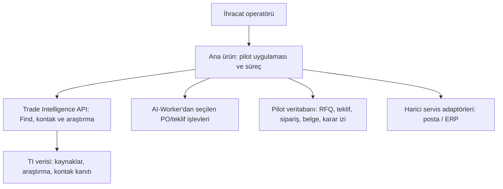
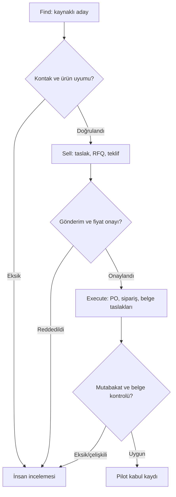

# FND-002 — 732690 / Almanya pilot mimarisi

Durum: **Pilot için kabul edilen teknik başlangıç kararı**, 29 Eylül 2026. Dayanak: [FND-001 bileşen denetimi](component-audit.md) ve [FND-017 pilot kapsamı](https://github.com/ErenKoc5806/export-growth-operations-engine/issues/1). Bu belge kurulu veya canlı bir entegrasyon iddiası değildir.

## Bileşen sınırı

- **Ana ürün deposu** pilot uygulamasını, kullanıcı görünümünü, süreç durumlarını, insan onaylarını, ticari veriyi ve Execute çıktısını sahiplenir. Pilot için tek uygulama ve yerel SQLite kalıcılığı yeterlidir. Ölçekleme/multi-tenant kararları ertelenir.
- **trade_intelligence** mevcut kaynak kodu ve verisini kendi reposunda tutar; ayrı süreç olarak mevcut HTTP API'si üzerinden araştırma ve kanıtlı aday/iletişim sonucu verir. Onun brokerage opportunity kayıtları ana ürünün RFQ, satış teklifi ve sipariş kayıtlarının yerine geçmez. İlk adapter, yalnızca seçilmiş 732690/DE çıktısını kendi kararlı şemasına çevirir.
- **AI-Worker** repo bağımsız kalır. Tüm paketi doğrudan aynı Python ortamında yüklemeyiz: `app` paket adı çakışıyor ve uygulamanın bazı modülleri import edilemiyor. PO eşleme ve inquiry/quotation gibi seçilmiş, saf işlevleri sözleşme testiyle adapte ederiz; hangi kodun taşınacağı ayrı commit/review konusudur. İlk pilotun çalışması AI-Worker ana giriş noktasına bağlı olmamalıdır.
- **Dış sistemler** ana üründe arayüz/adapter sınırındadır. Gerçek Canias/Outlook bağlantısı hazır değildir. Trade Intelligence içindeki Graph akışı yalnızca kullanıcı tarafından doğrulanmış muhatap, değişmez içerik, geçerli onay ve yetkili test posta kutusuyla ayrıca denenebilir. ERP için ilk çıktı yerel satış siparişi ve gözden geçirilebilir dışa aktarım; canlı kayıt sonraki kapı.

## Pilot veri sözleşmesi

Tüm aşamalar aynı `pilot_opportunity_id` ile izlenir. Her kaydın kaynak sistemi, oluşturma zamanı, durum sürümü ve denetim olayı bulunur. Referanslar `source_ref` + `source_url`/kanıt yolu taşır; belirsiz eşleşmeler otomatik olarak onaylanmaz.

1. **ProductProfile**: `hs6=732690`, üreticinin gerçek ürün/SKU açıklaması, birim, teknik nitelikler ve fiyat sahibi. HS6 yalnızca araştırma filtresidir.
2. **MarketTarget**: `country=DE`, hedef alıcı/distribütör profili ve araştırma zamanı.
3. **BuyerContact**: şirket kimliği, ad/rol, e-posta veya telefon, kaynak bağlantısı, doğrulama yöntemi/durumu, son kontrol zamanı. Doğrulanmamış iletişim canlı gönderime geçmez.
4. **SalesCase**: temas taslağı ve onay kaydı, gönderim sonucu, takip, RFQ, sürümlü teklif, fiyat/onay sahibi ve alıcı yanıtı.
5. **ExecutionCase**: müşterinin kabulü ve PO'su, satır bazında miktar/birim/para birimi/tutar mutabakatı, yerel satış siparişi, sevkiyat planı, taslak ticari fatura ve packing list; dış sistem kayıtları ayrı referans.
6. **AuditEvent**: aktör, eylem, önceki/yeni durum, zaman, kaynak/kanıt ve hata. Tekrar çalıştırmada `idempotency_key` kullanılır.

## Kontrol ve hata akışı

- Find sonucu ana ürüne **kanıtlı aday** olarak aktarılır; eşleşme şüpheli ise incelemeye düşer. Servis erişilemiyorsa önceki sonucu tarihli olarak gösterir, yeni doğrulama iddiasında bulunmaz.
- Gönderim yalnızca onaylı içerik ve kontrollü sağlayıcıyla yapılır. Bağlantı koptuğunda teslimatı otomatik tekrar denemez; `DELIVERY_UNKNOWN_REQUIRES_MANUAL_CHECK` durumu korunur.
- Teklif gerçek fiyat sahibinin onayıyla sürümlenir. RFQ/teklif/PO arasındaki ürün ve fiyat tutarsızlığı satış siparişini durdurur.
- Müşteri PO'sundan yerel sipariş idempotent oluşturulur. ERP adapter hatası siparişi dış sisteme gönderilmiş gibi göstermez; operatör incelemesi ve retry geçmişi tutulur.
- Sevkiyat planı ve fatura/packing list taslakları insana sunulur; gerçek lojistik rezervasyonu ve resmi işlem bu teknik pilotta bağımsız onay/entegrasyon gerektirir.

## Mock / canlı sınırı ve sahiplik

| İş | İlk teknik kabul | Canlı pilot kapısı | Hata sahibi |
| --- | --- | --- | --- |
| Comtrade ve alıcı keşfi | Kaynaklı fixture ve TI API sözleşmesi | Güncel veri/erişim, ürün uygunluğu ve iletişim kanıtı | TI kaynak hatası; ana ürün inceleme kuyruğu |
| E-posta | Kontrol edilen sahte sağlayıcı/posta kutusu, onay/red ve tekrar deneme testleri | Yetkili posta hesabı, muhatap/içerik onayı | Ana ürün gönderim durumu; sağlayıcı hata kodu |
| RFQ ve teklif | Sentetik kayıt, revizyon ve tutar testleri | Üretici fiyat/onay sahibi | Ana ürün Sell |
| Sipariş ve belgeler | Sentetik PO, yerel sipariş, belge taslağı/mutabakat | Gerçek PO ve operatör incelemesi | Ana ürün Execute |
| ERP ve lojistik | Adapter mock veya gözden geçirilebilir dışa aktarım | Yetkili ERP, test ortamı, işlem teyidi | İlgili adapter + ana ürün inceleme kuyruğu |

## Alternatifler ve seçim

- **Her şeyi ana depoya kopyalamak:** mevcut depoların bağımsızlığı ve test geçmişi kaybolur; seçilmedi.
- **İki repoyu aynı Python yorumlayıcısına doğrudan bağlamak:** `app` import çakışması ve AI-Worker giriş noktası hataları nedeniyle seçilmedi.
- **Her worker'a ayrı servis kurmak:** ilk pilot için gereksiz operasyon yükü; seçilmedi.
- **Seçim:** TI API için tek servis sınırı, ana üründe bir pilot uygulaması, AI-Worker'dan yalnızca ihtiyaç duyulan işlevlerin kontrollü adaptasyonu.

## İlk uygulama sırası

1. Ana üründe veri sözleşmesi ve 732690/DE sentetik fixture.
2. TI adapter ve kanıtlı kontak aktarımı; sözleşme testi.
3. Teklif/RFQ ve insan onaylı gönderim arayüzü.
4. PO mutabakatı → yerel satış siparişi → taslak fatura/packing list.
5. Tek fırsatı Find → Sell → Execute geçiren uçtan uca test; ardından gerçek servis/pilot kapıları.

FND-011 test stratejisi bu sınırları doğrulayacak. Detaylı ürün/SKU, operatör ve gerçek müşteri onayı FND-017'de hâlâ açıktır.
